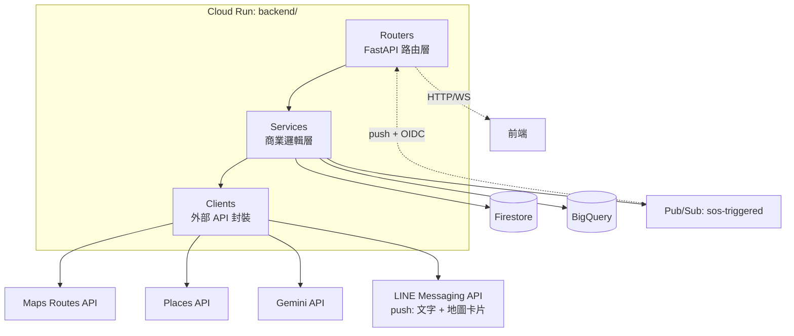
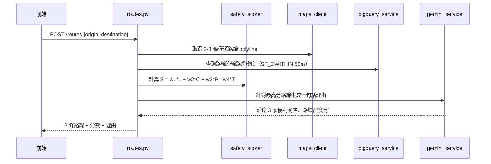
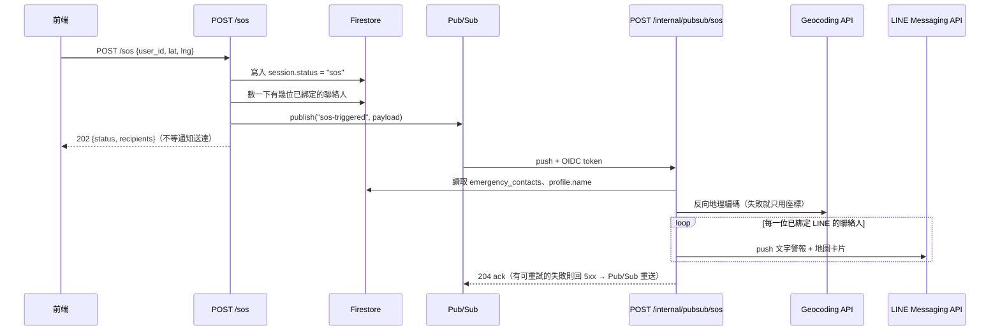

# NightMaMa 後端架構

> 對應 [prd.md](prd.md) Module 1-4，聚焦 `backend/`（Cloud Run FastAPI）。

---

## 1. 服務拆分

| 服務 | 執行環境 | 職責 |
|------|---------|------|
| **API Service** | Cloud Run | 路線規劃、風險辨識、SOS 觸發、定位串流、SOS 通知派送 |

只有一個運算層，狀態全部落在 Firestore / BigQuery，方便水平擴展與重啟。

**SOS 通知為什麼不獨立成 Cloud Function：** 原本規劃過 `functions/emergency_notify`，
但它需要的東西（Firestore client 與其獨立專案／憑證處理、LINE token、聯絡人讀取邏輯）
後端全部已經有了，拆出去等於維護第二套。改成 **Pub/Sub push subscription 打回後端的
`POST /internal/pubsub/sos`**：非同步解耦與內建重試這兩個原本要的性質完全保留，
少一個部署單位。代價是後端掛掉時通知也跟著停 —— 但 Pub/Sub 會重試到後端回來為止。

---

## 2. 分層架構



**規則：Router 不寫商業邏輯，Service 不碰 HTTP、Client 不知道呼叫者是誰。** 這樣測試時可以直接 mock Client 層，不用真的打外部 API。

---

## 3. 目錄結構（backend/）

```
backend/
├── main.py                      # FastAPI app 建立 + 路由掛載 + CORS + 例外處理
├── config.py                    # 環境變數集中讀取（Settings, pydantic-settings）
├── deps.py                      # 共用 FastAPI Depends（驗證、DB client 注入）
│
├── routers/
│   ├── routes.py                 # POST /routes           路線規劃
│   ├── sos.py                    # POST /sos               SOS 觸發
│   │                             # POST /internal/pubsub/sos  Pub/Sub push → 推播聯絡人
│   └── stream.py                 # WS   /stream/{user_id}  定位串流 + 語氣風險偵測
│
├── services/
│   ├── safety_scorer.py          # 安全權重評分（純函數，好單元測試）
│   ├── gemini_service.py         # Gemini 文字/語音封裝
│   ├── places_service.py         # Places API 查詢 + 快取
│   ├── bigquery_service.py       # 路燈 GIS 查詢、回報寫入
│   └── sos_service.py            # 組裝 SOS payload → publish；消費事件 → 推播 LINE
│
├── models/
│   └── schemas.py                # Pydantic request/response models
│
├── clients/
│   ├── maps_client.py            # Google Maps Routes API 低階呼叫 + 反向地理編碼
│   ├── line_client.py            # LINE Messaging API push（文字 / 地圖卡片）
│   └── firestore_client.py       # Firestore collection helper
│
├── Dockerfile
└── requirements.txt
```

只有 3 個功能模組（路線/SOS/語音串流），沒有必要拆更多層；`clients/` 只在 Client 邏輯超過一個 method 時才拆出獨立檔，否則直接寫在 `services/` 裡呼叫 SDK。

---

## 4. API 路由設計

| Method | Path | 說明 | 對應 PRD 模組 |
|--------|------|------|---------------|
| `POST` | `/routes` | 輸入起訖點 → 回傳 3 條候選路線 + 安全分數 | Module 1 |
| `WS` | `/stream/{user_id}` | 持續回傳定位 + 語音陪聊訊息，語氣異常時觸發重規劃 | Module 2/4 |
| `POST` | `/sos` | 觸發 SOS → 寫入 Firestore、發 Pub/Sub 事件 | Module 3 |
| `POST` | `/internal/pubsub/sos` | Pub/Sub push 回打 → 推播 LINE 給全部緊急聯絡人（驗 OIDC，僅限 Pub/Sub） | Module 3 |
| `POST` | `/report` | 匿名不安回報 → 寫入 BigQuery | Module 4 |
| `GET` | `/healthz` | Cloud Run 健康檢查 | — |

### 請求/回應範例

```jsonc
// POST /routes
{
  "origin": {"lat": 25.0498, "lng": 121.5773},
  "destination": {"lat": 25.0478, "lng": 121.5170},
  "weight_overrides": {"light": 2, "camera": 1, "store": 1, "time": 1}  // 選填，缺省用 Firestore 使用者偏好，再缺省用 {1,1,1,1}
}
// →
{
  "routes": [
    {"type": "fastest", "duration_min": 10, "score": 42, "polyline": "..."},
    {"type": "safest",  "duration_min": 13, "score": 88, "polyline": "...",
     "reason": "沿途 3 家便利商店、路燈密度高"},
    {"type": "balanced","duration_min": 11, "score": 65, "polyline": "..."}
  ]
}
```

```jsonc
// POST /sos
// lat/lng 可為 null：拿不到 GPS 不該讓求救送不出去，通知會明講「定位失敗」
{"user_id": "u123", "lat": 25.05, "lng": 121.55, "safety_score": 40}
// → 202 Accepted
// {"status": "accepted", "recipients": 2}
//   recipients = 這次會推播給幾位已綁定 LINE 的聯絡人。實際送出是非同步的，
//   前端靠這個數字辨認「0 個收件人」這種必定靜默失敗的情況，改開 LINE 分享連結。
```

---

## 5. 資料模型

### Firestore（用戶即時狀態，讀寫頻繁、schema 鬆散）

```
users/{user_id}
  ├─ emergency_contacts: [{name, phone, telegram_chat_id}]
  ├─ preferences:
  │    ├─ voice_enabled: bool
  │    └─ weight_overrides: {light, camera, store, time}   # 預設 {1,1,1,1}，使用者在設定頁調整重視程度
  └─ sessions/{session_id}
       ├─ status: "walking" | "sos" | "idle"
       ├─ current_location: GeoPoint
       └─ last_updated: Timestamp
```

`weight_overrides` 不存在或缺欄位時，`safety_scorer` 一律 fallback 成預設值 `{1,1,1,1}`，前端設定頁不用強制使用者調整。

### BigQuery（分析型資料，schema 固定、批次查詢）

```sql
-- streetlights：從 data.taipei 匯入，唯讀
streetlights(id, lat, lng, lux_estimate, source_updated_at)

-- cameras：從 data.taipei 路口監視器/巡邏箱開放資料匯入，唯讀
cameras(id, lat, lng, type, source_updated_at)

-- unsafe_reports：使用者匿名回報
unsafe_reports(id, lat, lng, reason, reported_at, session_hash)
```

**為何路燈/回報用 BigQuery、用戶狀態用 Firestore：** 前者是「大量點位做半徑空間查詢 + 趨勢分析」，BigQuery GIS 函數（`ST_DWITHIN`）划算；後者是「單一用戶高頻讀寫單一文件」，Firestore 延遲低、按文件計費更省。

---

## 6. 關鍵流程

### 6.1 安全路線規劃



### 6.2 SOS 觸發（解耦通知，避免通知失敗拖垮主流程）



**為什麼中間要墊一層 Pub/Sub：** LINE 可能逾時或失敗，不該讓使用者的 SOS 請求卡在那裡等——Pub/Sub 有內建重試。同理，通知失敗時 `/internal/pubsub/sos` 要回非 2xx 讓它重送，而不是自己吞掉。

**為什麼收件端是後端而不是 Cloud Function：** 見第 1 節。

**幾個刻意的取捨：**

- **重送去重的標記寫在「推播成功之後」。** 先寫的話，中途失敗的重試會被自己的標記擋掉，變成靜默漏送；反過來的代價只是極窄的併發視窗裡可能重複推播一次。重複的求救訊息遠比漏掉一則好。
- **4xx 不重試、5xx 與 429 才重試。** 收件人封鎖了官方帳號這種錯誤，重送幾次結果都一樣，只會拖著整條訂閱。
- **定位失敗時不送地圖卡片。** 附上一個猜的座標會把救援引到錯的地方，比誠實說「未取得位置」危險得多。同理 `session.current_location` 也不寫 `(0, 0)`。
- **`/sos` 同步回傳 `recipients`。** 實際推播是非同步的，前端無從得知結果；至少要讓它能辨認「0 個收件人」這種必定靜默失敗的情況，改開 LINE 分享連結讓使用者手動送，而不是顯示一個假的成功畫面。

---

## 7. 部署與環境變數

```
backend/Dockerfile → Cloud Run (min_instances=1，避免 SOS 冷啟延遲)
Pub/Sub topic + push subscription → 一次性建立，見 backend/scripts/setup_pubsub_sos.sh
```

`/internal/pubsub/sos` 在公網上打得到（後端是 `--allow-unauthenticated`），所以它會驗 Pub/Sub 帶來的 OIDC token：audience 與服務帳號都要對得上。`PUBSUB_PUSH_AUDIENCE` / `PUBSUB_PUSH_SA_EMAIL` 任一沒設就一律回 503（fail closed）——寧可通知送不出去被 log 抓到，也不要開一個誰都能用的免費 LINE 推播閘道。

| 變數 | 用途 |
|------|------|
| `GOOGLE_MAPS_API_KEY` | Routes / Places API |
| `GEMINI_API_KEY` 或 Vertex AI ADC | Gemini 呼叫 |
| `FIRESTORE_PROJECT_ID` | Firestore client |
| `BQ_DATASET` | BigQuery 路燈/回報 dataset |
| `LINE_CHANNEL_ACCESS_TOKEN` | 推播 SOS 通知給緊急聯絡人（與前端共用同一個 secret） |
| `PUBSUB_TOPIC_SOS` | sos.py 發布事件用的 topic 名稱 |
| `PUBSUB_PUSH_AUDIENCE` | `/internal/pubsub/sos` 驗 OIDC token 的 audience（＝後端服務網址） |
| `PUBSUB_PUSH_SA_EMAIL` | 只接受這個服務帳號推來的 Pub/Sub 請求 |

本機開發用 `.env` + `pydantic-settings`；正式環境變數交給 Cloud Run 的 Secret Manager 掛載，不寫死在 Dockerfile。

---

## 8. 錯誤處理原則

- 外部 API（Maps/Places/Gemini）呼叫失敗 → `services/` 層 catch，降級處理（例如 Places 查不到店家就只用路燈分數），不讓單一外部服務掛掉整個 `/routes`。
- `/sos` 是安全關鍵路徑：Firestore 寫入失敗要直接回錯（讓前端知道要重試）；Pub/Sub publish 失敗一樣不能吃掉，回 502 並記 log，前端據此退回「開 LINE 手動送出」（未送達通知等於沒 SOS）。
- 前端任何一條退路都不可以把「已受理」講成「已送達」。走 Pub/Sub 時通知是非同步的，UI 用字是「正在通知 N 位聯絡人」；讓使用者以為訊息已經送到而放棄改打電話，是這個 App 最糟的失效模式。
- WebSocket 斷線：前端負責重連，後端不做斷線補償邏輯（YAGNI，除非之後發現定位遺漏是真實問題）。
