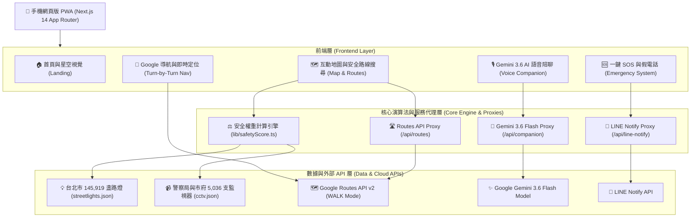
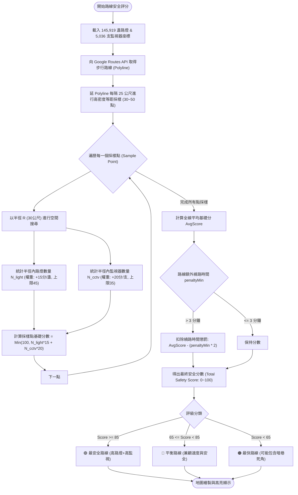
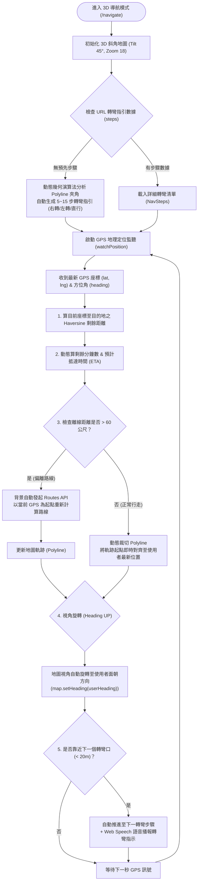
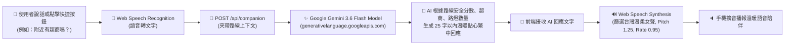
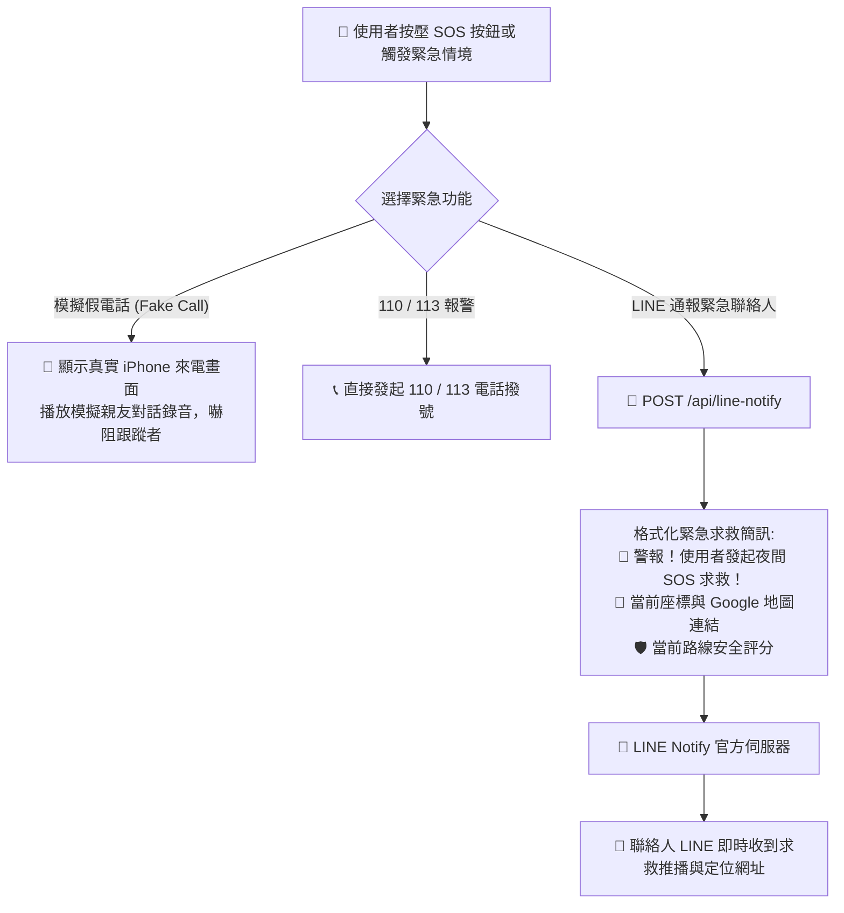

# 🌙 NightMaMa 夜間安全導航與 AI 虛擬陪伴系統 - 架構與流程圖文件

本文件詳細記錄 **LumiMAMA / NightMaMa** 的整體系統架構、夜間安全加權演算法、Google Maps Turn-by-Turn 導航、Gemini 3.6 Flash 雙向語音陪伴及 SOS 應急通報之完整流程圖。

---

## 1. 🏗️ 系統總體架構圖 (System Architecture)

---

## 2. ⚖️ 夜間加權安全演算法流程圖 (Night Safety Scoring Engine)

本演算法捨棄傳統「僅求最快」導航，改採**高照明度 (路燈)**、**高巡邏監視密度 (CCTV)** 為權重計算標準：

---

## 3. 🧭 Google Maps Turn-by-Turn 導航與即時 GPS 追蹤流程圖

導航模式實現面朝方向朝上 (`Heading UP`) 旋轉與實時動態裁切：

---

## 4. 🎙️ Gemini 3.6 Flash AI 雙向語音陪伴流程圖

---

## 5. 🆘 一鍵 SOS 緊急通報流程圖

---

> 專案名稱：NightMaMa — 夜間安全導航與 AI 虛擬陪伴系統
