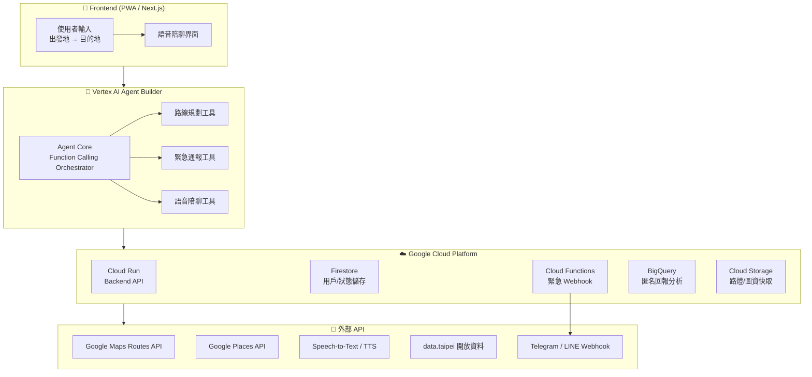

# NightMaMa（LumiMAMA）開發計劃

> 夜間安全導航 × AI 語音陪伴 × 緊急聯動 — 基於 Google Cloud Platform

---

## 背景摘要

傳統導航只給「最快路線」；NightMaMa 提供「最安全路線」——整合路燈密度、24H 店家、監視器分佈與 AI 語音陪伴感知，為夜間獨行者（尤其女性）提供安全守護。

> [!IMPORTANT]
> 本計劃以「台北市」作為 Phase 1 城市，原因：data.taipei 路燈點位資料完整，與競品（含 UCL Safest Way）「先在資料完整城市落地」策略一致。

---

## 系統架構總覽



---

## 功能模組分解

### Module 1 — 安全路線引擎（核心）

| 功能 | 技術 | 說明 |
|------|------|------|
| 自訂權重路線計算 | Google Maps Routes API | 以路燈密度 × 店家數 × 監視器分佈加權 |
| 路燈點位資料 | data.taipei + BigQuery | 定期同步，空間查詢半徑 50m 計算照明密度 |
| 監視器點位資料 | data.taipei + BigQuery | 路口監視器/巡邏箱開放資料，同路燈方式做空間查詢 |
| 夜間店家查詢 | Google Places API | 篩選 `open_now=true` + `24_hours` 店家 |
| 路線評分模型 | Gemini 2.5 Flash | 對每條候選路線打「安全分數」並給出理由 |

**安全權重公式（概念）：**

路線先切成 50-100m 一段，每段各自計算：

$$S_{segment} = w_1 \cdot L_{density} + w_2 \cdot C_{density} + w_3 \cdot P_{density}$$

路線分數取**最低分路段**（而非平均），再扣時間懲罰：

$$S_{route} = \min(S_{segment_1}, \dots, S_{segment_n}) - w_4 \cdot \log(1 + T_{extra})$$

- $L$：路燈密度分數（每 100m 盞數，非路線總數）
- $C$：監視器 / 巡邏箱密度（同上，data.taipei 開放資料）
- $P$：24H 店家密度（人流代理指標）
- $T$：超時懲罰（比最快路線多的分鐘數，取 log 避免蓋掉安全分數差異）

> 用最低分路段而非平均，是因為使用者真正在意的是路線上「最暗那一段」，一段全黑小巷不該被其餘路段的高分稀釋掉。

**權重由使用者調整，而非系統代為決定：** 每個人重視的因素不同（有人怕暗、有人怕沒人煙、有人只在意離開最快），與其系統武斷決定 $w_1..w_4$，不如在設定頁讓使用者用滑桿調整（例如「重視照明」拉高 $w_1$），存進 Firestore `preferences.weight_overrides`，未調整時預設 1:1:1:1。路線規劃 API 每次請求都可帶入當次權重，不用綁死在使用者長期偏好上（例如今天想抄比較快的路，臨時把 $w_4$ 拉高）。

---

### Module 2 — 即時語音陪伴

| 功能 | 技術 | 說明 |
|------|------|------|
| 語音陪聊 | STT + Gemini + TTS | 使用者步行時可隨時對話 |
| 語氣急促偵測 | STT + Gemini 情緒分析 | 語音異常時自動升級危險等級 |

---

### Module 3 — 緊急防護聯動

| 功能 | 技術 | 說明 |
|------|------|------|
| 動態避險重規劃 | Agent Function Calling | 偵測風險 → 自動導引至最近安全點 |
| 緊急通知 | Cloud Functions + Telegram/LINE Webhook | 含即時定位 + 狀態快照 |
| 假裝來電（Streetwise 借鏡） | 純前端 UI | 低技術高體驗，緩解不適感 |
| 一鍵 SOS | Cloud Run Endpoint | 觸發完整緊急流程 |

---

### Module 4 — 後端治理 & 城市數據

| 功能 | 技術 | 說明 |
|------|------|------|
| 用戶設定 / 狀態 | Firestore | 緊急聯絡人、偏好設定、對話記憶 |
| 定位串流 | Cloud Run WebSocket | 持續追蹤步行位置 |
| 匿名不安回報 | BigQuery | 熱區分析，城市治理參考 |
| 語意歸納 | Vertex AI / Gemini | 結構性暗區模式識別 |

---

## GCP 技術堆疊對照表

| 功能模組 | GCP / Google 技術 | 用途 |
|----------|-------------------|------|
| Agent 大腦 | **Vertex AI Agent Builder** | Function Calling 協調器 |
| 語音/文字推理 | **Gemini 2.5 Flash / Pro** | 語音語氣分析、路線評分理由生成 |
| 語音互動 | **Speech-to-Text + TTS API** | 即時語音轉文字 / 回應朗讀 |
| 路線規劃 | **Maps Routes API** | 自訂安全權重路線矩陣 |
| 店家資料 | **Google Places API** | 夜間營業店家查詢 |
| 路燈資料 | **data.taipei + Cloud Storage** | 路燈座標快取 |
| 後端服務 | **Cloud Run** | API 服務 + WebSocket 定位串流 |
| 緊急通知 | **Cloud Functions** | Telegram/LINE Webhook 觸發 |
| 資料儲存 | **Firestore** | 用戶設定、緊急聯絡人、對話狀態 |
| 熱區分析 | **BigQuery** | 匿名回報彙整 |
| 語意分析 | **Vertex AI Search / Gemini** | 結構性暗區語意歸納 |

---

## 開發階段規劃

### Phase 0 — 環境建置（預估 1 天）

- [ ] 建立 GCP 專案，啟用所有必要 API
- [ ] 設定 Firebase / Firestore 資料庫
- [ ] 申請 Google Maps Platform（Routes + Places）金鑰
- [ ] 爬取並匯入 data.taipei 路燈點位資料至 BigQuery
- [ ] 爬取並匯入 data.taipei 路口監視器/巡邏箱點位資料至 BigQuery
- [ ] 建立 Vertex AI Agent 基本框架

---

### Phase 1 — MVP：安全路線引擎（預估 2-3 天）

**目標：** 輸入起終點 → 回傳 3 條候選路線（最快 / 最安全 / 平衡）

- [ ] 實作路燈/監視器密度空間查詢（BigQuery GIS）
- [ ] 串接 Google Places API 查詢沿途夜間店家
- [ ] 實作分段安全評分函數（取最低分路段，支援權重覆寫）
- [ ] 串接 Maps Routes API 取得候選路線
- [ ] Gemini 對路線打分並生成說明文字
- [ ] 基本前端：地圖顯示 + 路線選擇 + 權重調整滑桿

**Demo 情境達成：**
> 松山車站 → 目的地：捨棄 10 分鐘漆黑小巷，改推 13 分鐘高照明路線

---

### Phase 2 — 多模態感測（預估 2 天）

**目標：** 語音陪聊 + 語氣異常偵測觸發重規劃

- [ ] STT 整合：使用者說話 → 文字
- [ ] Gemini 對話回應 → TTS 朗讀
- [ ] 風險觸發 → Agent 自動重規劃路徑

---

### Phase 3 — 緊急聯動系統（預估 1-2 天）

**目標：** SOS 一鍵通報 + 自動 Telegram/LINE 通知

- [ ] Firestore 緊急聯絡人設定介面
- [ ] Cloud Functions 部署 Telegram Webhook
- [ ] Cloud Run 定位串流 WebSocket
- [ ] SOS 按鈕 → 觸發完整緊急流程
- [ ] 假裝來電 UI 功能（純前端）

---

### Phase 4 — 治理數據 & 優化（預估 1 天）

**目標：** 回報機制 + BigQuery 熱區分析

- [ ] 使用者「不安回報」功能
- [ ] BigQuery 熱區視覺化（Looker Studio 或前端圖表）
- [ ] Vertex AI 語意歸納結構性暗區
- [ ] 效能調優、錯誤處理補強

---

## 專案目錄結構

```
NightMaMa/
├── frontend/                    # Next.js PWA
│   ├── app/
│   │   ├── page.tsx             # 首頁（輸入起終點）
│   │   ├── navigate/page.tsx    # 導航進行中頁面
│   │   ├── sos/page.tsx         # 緊急 SOS 頁面
│   │   └── settings/page.tsx    # 設定頁（緊急聯絡人）
│   ├── components/
│   │   ├── MapView.tsx          # Google Maps 地圖元件
│   │   ├── RoutePanel.tsx       # 路線選擇面板
│   │   ├── VoiceCompanion.tsx   # 語音陪聊元件
│   │   └── FakeCall.tsx         # 假裝來電 UI
│   └── lib/
│       ├── maps.ts              # Maps API 封裝
│       └── agent.ts             # Agent API 呼叫封裝
│
├── backend/                     # Cloud Run 服務
│   ├── main.py                  # FastAPI 主入口
│   ├── routers/
│   │   ├── routes.py            # 路線規劃 API
│   │   ├── risk.py              # 語氣風險辨識 API
│   │   ├── sos.py               # SOS 觸發 API
│   │   └── stream.py            # 定位串流 WebSocket
│   ├── services/
│   │   ├── safety_scorer.py     # 安全權重評分引擎
│   │   ├── gemini_service.py    # Gemini API 封裝
│   │   ├── places_service.py    # Places API 封裝
│   │   └── bigquery_service.py  # 路燈/回報資料查詢
│   └── Dockerfile
│
├── functions/                   # Cloud Functions
│   └── emergency_notify/
│       └── main.py              # Telegram/LINE Webhook 觸發
│
├── agent/                       # Vertex AI Agent 定義
│   ├── agent_config.yaml        # Agent Builder 設定
│   └── tools/
│       ├── route_tool.py        # 路線規劃工具
│       ├── risk_tool.py         # 語氣風險辨識工具
│       └── sos_tool.py          # 緊急通報工具
│
├── data/                        # 資料處理腳本
│   ├── import_streetlights.py   # data.taipei 路燈匯入 BigQuery
│   └── schema/
│       └── streetlights.json    # BigQuery Schema 定義
│
└── infra/                       # GCP 基礎設施
    ├── terraform/               # （可選）IaC 設定
    └── deploy.sh                # 一鍵部署腳本
```

---

## Demo 情境腳本

### 情境 A — 基本安全導航
1. 使用者輸入：「松山車站 → [目的地]」
2. Agent 回傳 3 條路線，標示各路線安全分數
3. 推薦路線：多 3 分鐘但沿途有 3 家便利商店 + 高路燈密度

### 情境 B — 緊急 SOS
1. 使用者按下 SOS / 語氣急促觸發
2. Cloud Functions 自動發送 Telegram 給緊急聯絡人
3. 訊息包含：即時 Google Maps 定位連結 + 目前所在路段安全評分

---

## 競品差異化策略

| 競品 | 策略 | NightMaMa 差異化 |
|------|------|-----------------|
| Safest Way (UCL) | 學術背景扎實 | 台北在地資料 + 即時陪聊 |
| Walkable | Walkable Score | AI 即時語音感測 + 語氣異常偵測 |
| SafeWalkMaps | 虛擬夥伴 | 自動緊急通知聯動，不需手動操作 |
| Streetwise | 眾包回報 | AI 語意歸納代替純統計分析 |

> [!NOTE]
> Pitch 論述建議：「連 UCL 學術級產品都受限資料完整度，我們選擇先聚焦台北市——因為 data.taipei 路燈點位資料完整，這是務實的第一步。」

